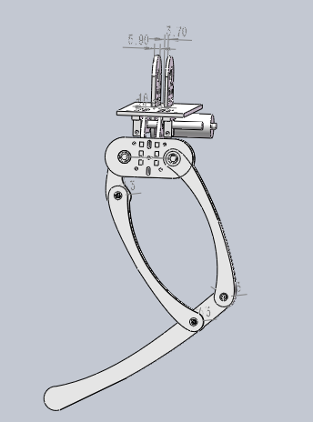

# playground

## EM
EM(Expectation-Maximization) algorithm

## GaussianNet
An idea for generate an gaussian attention for image.

## RLS
Robust Least Square.

## alg
Learing introduction to algorithms.

## course
Open course.

## detection
Detection using CNN architectures.

## dog
A solidworks dog model.

## kalman
Get mpu6050 data use python on ubuntu and ekf, ukf simulation using matlab.

## matrix
A library for matrix. Please see the README.md file for using it.
an idea for generate an gaussian attention for image.

## pf
implementation of partical filter

## processing
Read the book [The Nature of the Code](https://natureofcode.com/).

## segmentation
Sgmentation using CNN architectures. Implement the segmentation network architectures [U-Net](https://lmb.informatik.uni-freiburg.de/people/ronneber/u-net/) and [TernausNetV2](https://github.com/ternaus/TernausNetV2) for image segmentation. The network architecture use the code in [TernausNetV2](https://github.com/ternaus/TernausNetV2).

# simlink_tutorials
Several simulink models, Reading the book "Legged Robots That Ballance".

## undergraduate 
An undergraduate thesis project. Using line laser and camera reconstruct the environment. (still need to clean up)

