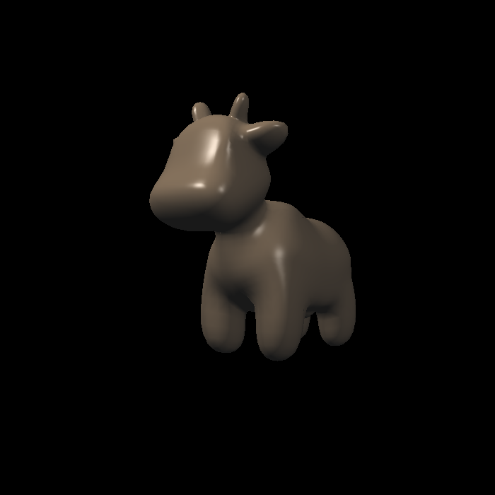

## GAMES101 blinn-phong

## GAMES101 Path Tracing

## GAMES202 Sreen Space Reflection

## Matlab建模，状态机+PID控制单腿跳跃机器人

## C++矩阵库
[matrix](../matrix/README.md)

## 线激光扫描物体
[https://github.com/heylfda/easyscan](https://github.com/heylfda/easyscan)

## 多目标跟踪
[https://github.com/heylfda/CircleTrack](https://github.com/heylfda/CircleTrack)

## 线型激光三维重建

)
