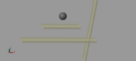

## train
train model learn from[here](http://ctms.engin.umich.edu/CTMS/index.php?example=Introduction&section=SimulinkControl)

## Legged_Robots_That_Balance
Models learn from the book Legged_Robots_That_Balance.
### ball

### Chapter2

## pendulum & simple_pendulum
pendulum model learn from [here](http://ctms.engin.umich.edu/CTMS/index.php?example=Introduction&section=SimulinkControl)

## dog
unfinished dog robot model.
